# 網站前端範例合輯

> [!NOTE]
> 沒有個人設計，只有仿製 
> 唯一有自行設計的項目為 [JOBALL找專家](https://joball.tw)

  

## 項目介紹

這些範例的代碼包含了 HTML 渲染，純 JS 渲染 
隨著 2023/09 開始 [PDRenderKit](https://github.com/pardnchiu/PDRenderKit) (原 PDExtension) 的框架功能開發，有修改幾個項目來測試與完善框架 
原本打算花時間全部改寫為 PDRenderKit 渲染，但在過程中又開啟了 [Website Builder](https://github.com/pardnchiu/website-builder) 項目 
因此決定不會再針對現有的項目進行修改 
並且 2024/10 開始，授權從 GPL3.0 改爲 MIT

- ### Smart Clock (Voice Control)
    製作日期: 2024/12/20
    [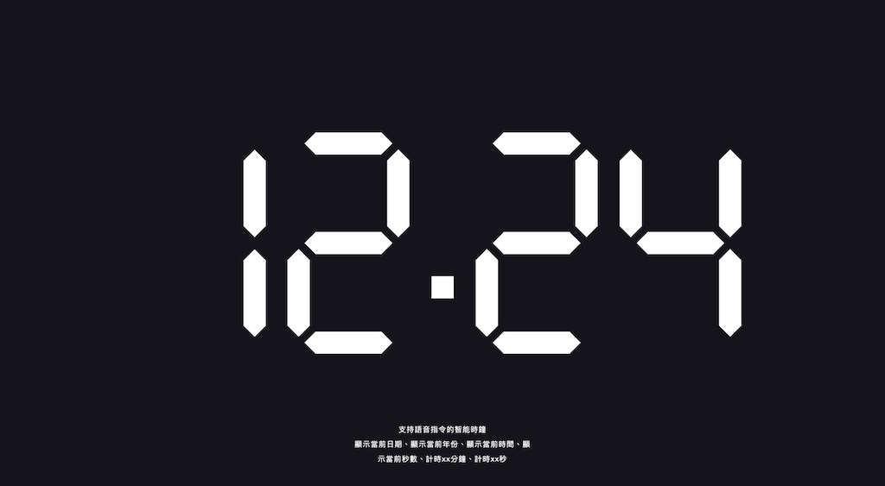](https://pardn.io/web-template/target/20241220)
- ### Zeczec
    製作日期: 2024/06/25
    [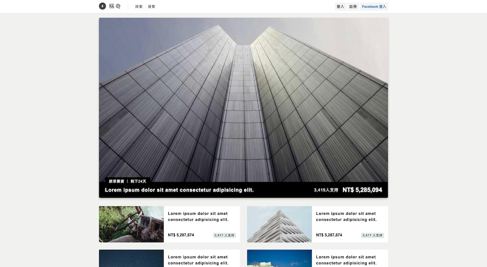](https://pardn.io/web-template/target/20240625)
- ### Social Networking
    製作日期: 2023/07/30
    
- ### Minimal Blog
    製作日期: 2023/07/23
    
- ### Classic Blog
    製作日期: 2023/07/22
    
- ### Personal Blog with Cover
    製作日期: 2023/07/21
    
- ### Personal Blog
    製作日期: 2023/07/20
    
- ### Magazine Blog
    製作日期: 2023/07/19 / <mark>最後更新: 2024/08/08</mark>
    
- ### Simplify Blog
    製作日期: 2023/07/12
    
- ### App Introduction
    製作日期: 2023/07/10
    
- ### Personal Page With Blog
    製作日期: 2023/06/21
    
- ### Gym Introducing
    製作日期: 2023/06/19 / <mark>最後更新: 2024/08/03</mark>
    
- ### Personal Profile
    製作日期: 2023/06/16
    
- ### About Me Page
    製作日期: 2023/06/13
    
- ### Presonal Info
    製作日期: 2023/06/10
    
- ### Personal Page
    製作日期: 2023/06/10
    
- ### Service Introduction
    製作日期: 2023/06/05
    [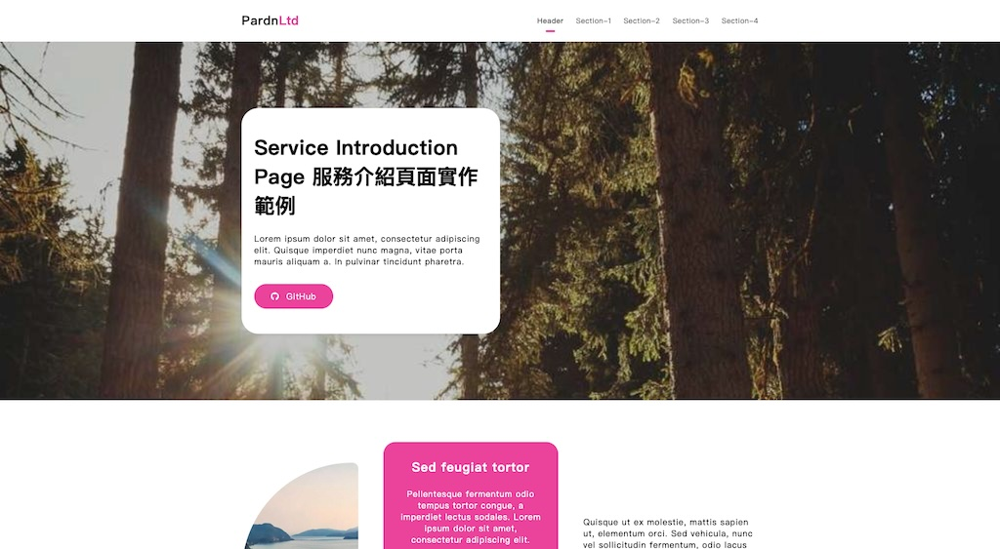](https://pardn.io/web-template/target/20230605)
- ### Restaurant Introduction
    製作日期: 2023/06/04
    
- ### Personal Profile
    製作日期: 2023/05/12
    
- ### Moneybook
    製作日期: 2023/04/18
    
- ### Store Page
    製作日期: 2023/03/14
    
- ### Product Introduction
    製作日期: 2023/03/12
    
- ### Basic
    製作日期: 2023/03/11
    [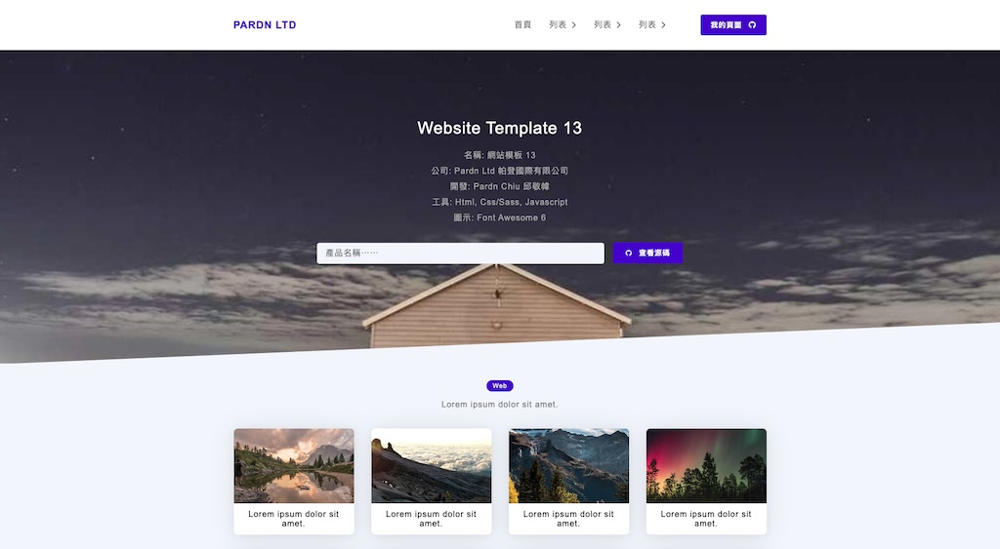](https://pardn.io/web-template/target/20230312)
- ### Blog
    製作日期: 2023/03/10
    [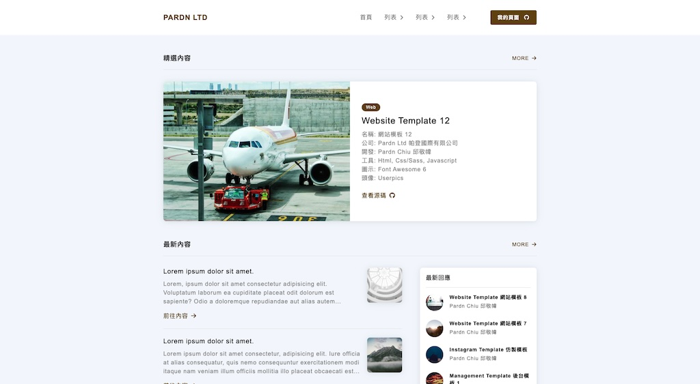](https://pardn.io/web-template/target/20230311)
- ### Basic
    製作日期: 2023/03/10
    [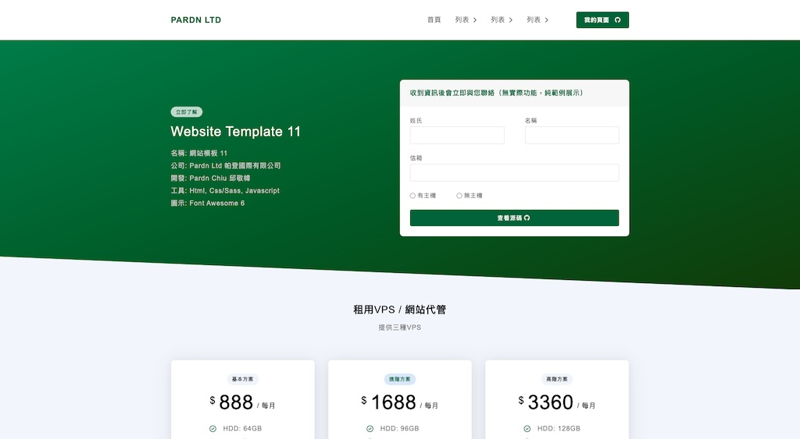](https://pardn.io/web-template/target/20230310)
- ### Gallery Page
    製作日期: 2023/03/09
    
- ### App Introduction
    製作日期: 2023/03/0
    [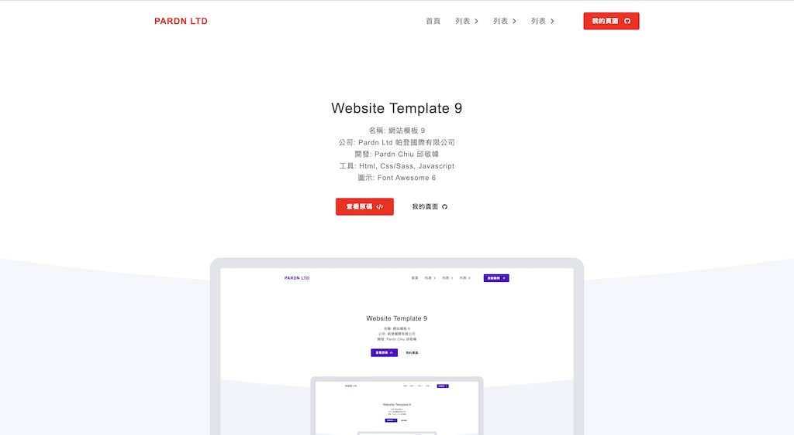](https://pardn.io/web-template/target/20230306)
- ### App Introduction
    製作日期: 2023/03/02
    [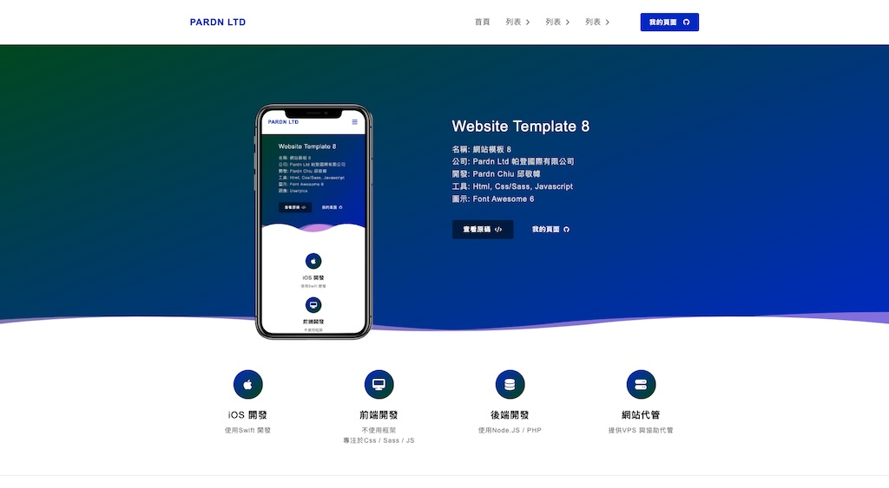](https://pardn.io/web-template/target/20230302)
- ### Service Info
    製作日期: 2023/03/01
    
- ### Personal Portfolio
    製作日期: 2023/02/26
    
- ### Personal Introduction
    製作日期: 2023/02/20
    
- ### Instagram
    製作日期: 2022/10/12
    [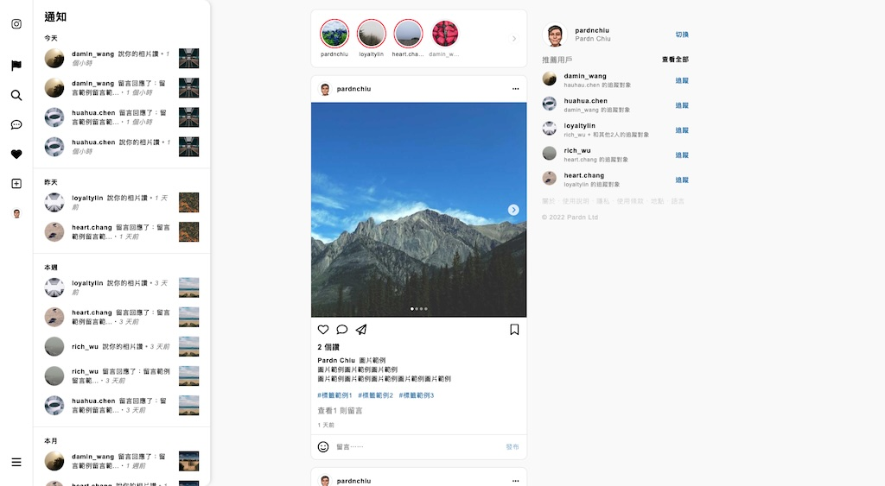](https://pardn.io/web-template/target/20221012)
- ### Restaurant Introduction
    製作日期: 2022/05/25
    
- ### Basic
    製作日期: 2022/04/18
    [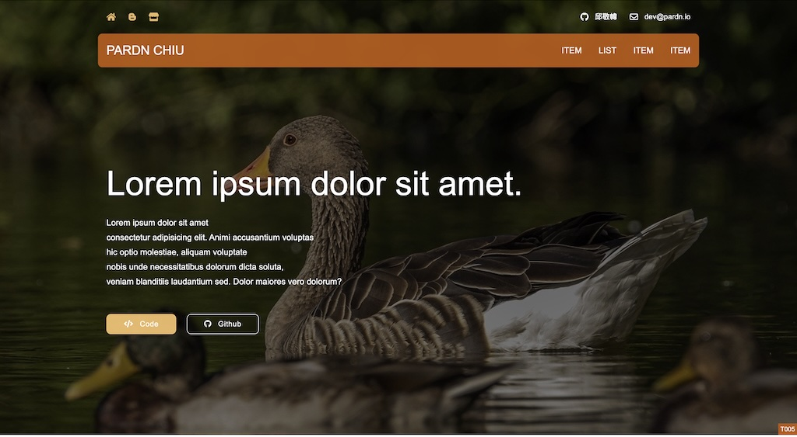](https://pardn.io/web-template/target/20220418)
- ### Basic
    製作日期: 2022/04/13
    [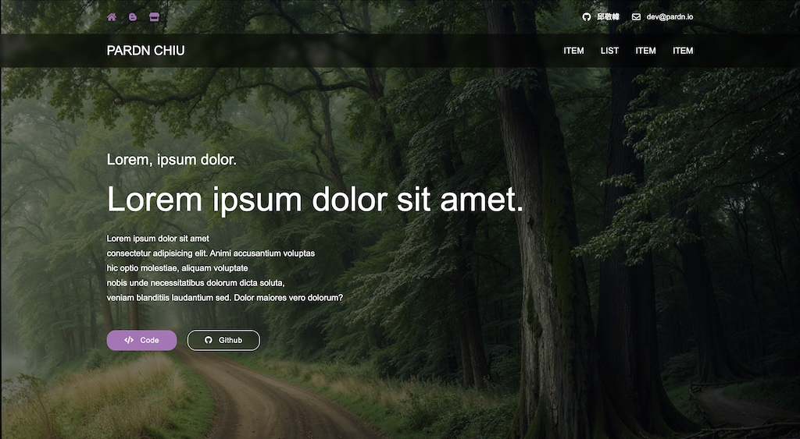](https://pardn.io/web-template/target/20220413)
- ### Basic
    製作日期: 2022/04/12
    [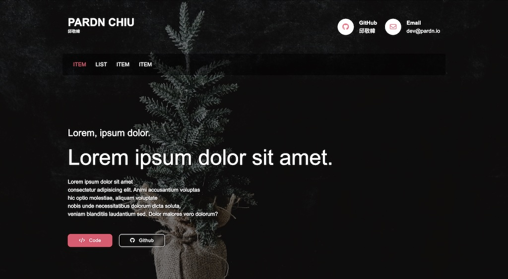](https://pardn.io/web-template/target/20220412)
- ### Basic
    製作日期: 2022/04/09
    [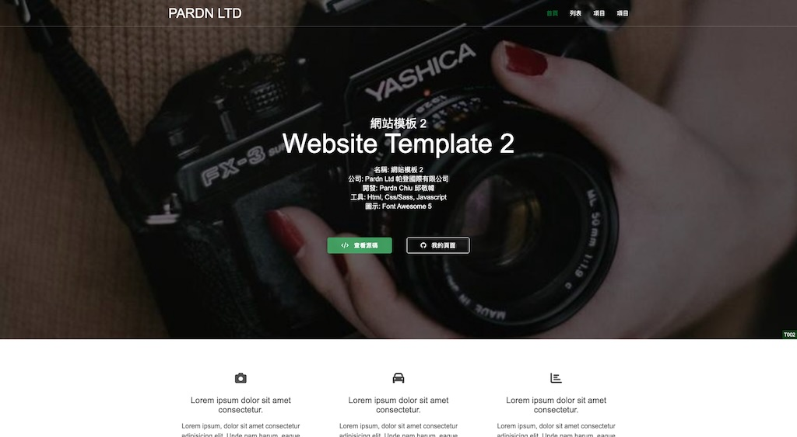](https://pardn.io/web-template/target/20220409)
- ### Basic
    製作日期: 2022/04/08
    

## Creator

<h4 style="padding-top: 0">邱敬幃 Pardn Chiu</h4>

 